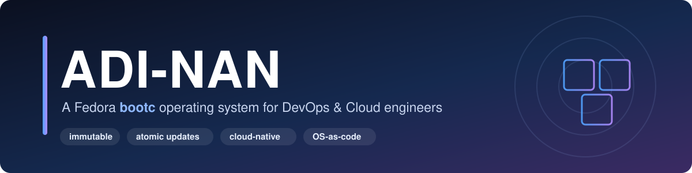
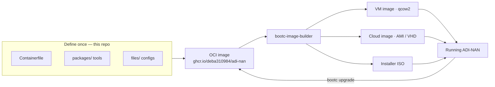
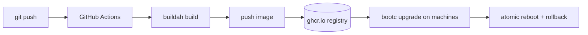

<p align="center">
  
</p>

<h1 align="center">ADI-NAN</h1>

<p align="center">
  <b>An image-based Linux OS, built like a container, shipped like a cloud image —</b><br>
  purpose-built for DevOps and cloud engineers, with the whole toolchain baked in.
</p>

<p align="center">
  <a href="https://github.com/deba310984/ADI-NAN/actions/workflows/build.yml"></a>
  
  
  
  <a href="LICENSE"></a>
</p>

<p align="center">
  
  
  
  
  
  
  <br>
  
  
  
  
</p>

---

## 🧭 What is ADI-NAN?

ADI-NAN is a Linux operating system whose **entire definition lives in a `Containerfile`** — the same syntax you already use for containers. You build it like an image, publish it to a registry, and turn that one image into whatever bootable form you need: a VM disk, a cloud AMI, or a bare-metal installer ISO.

Because it's built on **[Fedora `bootc`](https://docs.fedoraproject.org/en-US/bootc/)**, updates are **atomic** (they either fully apply or don't) and **roll back cleanly**. The base is immutable, so every machine running ADI-NAN is identical and reproducible — the dream for fleets, CI runners, and dev workstations alike.

And it ships **ready to work**: `kubectl`, `helm`, `tofu`, `ansible`, the AWS/Azure/GCP CLIs, and dozens more are already installed and wired into a cloud-aware shell.

> 💡 **In one line:** your OS is code — version-controlled, CI-built, and updated with `bootc upgrade`.

---

## 🎯 Why build an OS this way?

| Traditional distro | ADI-NAN (image-based) |
|---|---|
| Configured by hand or drifting scripts | Defined once in a `Containerfile` |
| "Works on my machine" snowflakes | Every machine is byte-identical |
| Risky in-place `dnf upgrade` | Atomic update + instant rollback |
| One install target | One image → VM, cloud, and bare metal |
| Tools installed ad-hoc later | Full DevOps toolchain baked in |

---

## 🏗️ How it works

Define the OS once, then render it into any bootable form — and machines update straight from the registry.



## 🔁 Build & update pipeline

Every push rebuilds the image in CI and publishes it; a weekly job absorbs upstream Fedora updates automatically.



---

## 📦 What's inside

| Category | Tools |
|---|---|
| 🐳 Containers | podman · buildah · skopeo · cosign |
| ☸️ Kubernetes | kubectl · helm · k9s · kustomize · stern · kubectx/kubens · argocd · flux |
| 🏗️ IaC / config | OpenTofu (`tofu`) · Ansible |
| ☁️ Cloud CLIs | AWS CLI v2 · Azure CLI · Google Cloud CLI |
| 🔐 Secrets | sops · age |
| 🛠️ Dev / CI | git · git-lfs · gh · direnv · mise · pre-baked completions |
| 🖥️ Shell / TUI | zsh + starship (kube/cloud-aware prompt) · fish · tmux · neovim · fzf · ripgrep · bat · btop · fastfetch |
| 🌐 Net / debug | dig · nmap · tcpdump · mtr · httpie · socat · jq · yq |

> The OS `ID` in `/etc/os-release` stays `fedora` on purpose so `dnf` and Fedora tooling keep working — only the display name is branded ADI-NAN.

---

## 🚀 Quickstart

You need a **Linux build host with `podman`** (Linux images can't be built on Windows directly). On Windows 11, use **WSL2**; or let GitHub Actions build it for you and only boot-test in a VM.

```bash
# 1. Build the OS image
bash scripts/build.sh                 # -> adi-nan:latest

# 2. Verify the toolchain inside it
podman run --rm -it adi-nan:latest bash -lc 'kubectl version --client; tofu version; aws --version'

# 3. Build a bootable VM disk (edit bootc-image-builder/config.toml first to add your SSH key)
sudo bash scripts/build-disk.sh qcow2 # -> output/qcow2/disk.qcow2
```

Other disk types: `ami` (AWS), `raw`, `vmdk`, `anaconda-iso` (bare-metal installer).

Once a machine is running ADI-NAN, it updates itself from the registry:

```bash
sudo bootc upgrade    # pulls the newest image, stages it; reboot to apply
```

---

## 🗂️ Repository layout

```
ADI-NAN/
├── Containerfile               ← the OS definition (start here)
├── packages/
│   ├── dnf-packages.txt         ← packages from Fedora repos
│   └── tools.sh                 ← tools not in repos, version-pinned
├── files/                       ← configs copied verbatim into the image (/)
│   └── etc/…                    ← profile.d, /etc/skel dotfiles, motd, starship
├── bootc-image-builder/
│   └── config.toml              ← users, filesystem, kernel args for disk images
├── scripts/
│   ├── build.sh                 ← build the container image
│   └── build-disk.sh            ← render a bootable disk / ISO
├── docs/banner.svg              ← README hero art
└── .github/workflows/build.yml  ← CI: build + push image to ghcr.io
```

---

## 🛠️ Customizing

- **Add/remove Fedora packages** → edit [`packages/dnf-packages.txt`](packages/dnf-packages.txt)
- **Add a tool not in Fedora** → add a block to [`packages/tools.sh`](packages/tools.sh) (pin its version)
- **Change defaults/dotfiles** → drop files under [`files/`](files/) mirroring the target path
- **Change users / disk / kernel** → edit [`bootc-image-builder/config.toml`](bootc-image-builder/config.toml)

Rebuild after any change with `bash scripts/build.sh`.

---

## 🗺️ Roadmap

- [ ] A local `k3s` / `kind` cluster that comes up on first boot
- [ ] Signed images (`cosign`) + verified `bootc` updates
- [ ] A GNOME desktop variant for engineer workstations
- [ ] A committed `mise.toml` toolset (Go, Node, Python)
- [ ] Hardening pass (SSH, firewalld defaults, auditd)

---

## 🤝 Contributing & License

Contributions are welcome — big or small. See **[CONTRIBUTING.md](CONTRIBUTING.md)** for how to build, test, and open a pull request. Every push and PR is built automatically by CI.

Released under the **[MIT License](LICENSE)** — free to use, modify, and share.

---

<p align="center">
  <sub>Built with ☕ and <a href="https://containers.github.io/bootc/">bootc</a> · Powered by <a href="https://docs.fedoraproject.org/en-US/bootc/">Fedora</a> · Inspired by <a href="https://universal-blue.org/">Universal Blue</a></sub>
</p>
